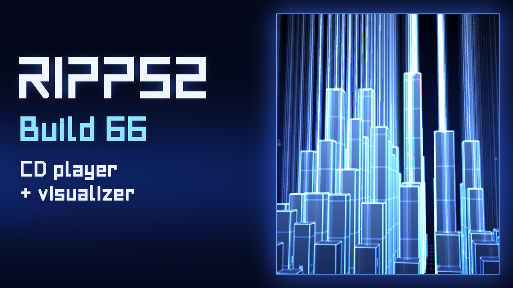

# RIPPS2

> ### Kill it: RIPPS2 build 72 (alpha)
> **RIP PS2, the ELF killer.** ELF-sufficient, never ELF-destructive: your other ELFs stay safe on the shelf (nothing is deleted unless you ask), they just get a well-earned rest.
> 1. **[Download RIPPS2.elf](https://github.com/akilluminati47/RIPPS2/releases/download/v0.0.72-alpha/RIPPS2.elf)** (one file, about 2.2 MB).
> 2. Copy it to a USB stick or memory card, and launch it from FreeMcBoot, PS2BBL, wLaunchELF or whatever you already use to start homebrew. In PCSX2: **System > Start File** and pick `RIPPS2.elf`.
> 3. Tell us how it went: [open an issue](https://github.com/akilluminati47/RIPPS2/issues) or find **#RIPPS2** on the developers' Discord, [discord.gg/ggkCDWqhE](https://discord.gg/ggkCDWqhE) (invite good for October 2026).
>
> [What's new in build 72](https://github.com/akilluminati47/RIPPS2/releases/tag/v0.0.72-alpha) | [Changelog](CHANGELOG.md) | [Watch the build 66 reel](https://youtu.be/jRbt9ScaBNw) | [Every release](https://github.com/akilluminati47/RIPPS2/releases)

[](https://youtu.be/jRbt9ScaBNw)

RIPPS2 is a PS2 front end in a single `.elf`: a teardown and rebuild of [RiptOPL](https://github.com/NathanNeurotic/Open-PS2-Loader) (the Open PS2 Loader fork) with its own look, launchers, file browser and save tools. Glass towers stand behind your games and orbit formations behind your files, all drawn live by the PS2.

- **LAUNCH DISC** boots PS2, PS1 and DVD video discs, says which game is in the drive before you start it, and plays audio CDs with the towers turned into a spectrum analyser.
- **STORAGE** is your game library: every drive in one list, with art, an info page whose art crossfades with the screenshots, and per-game settings.
- **MEMORY FILES** is a built-in file browser: copy, move and delete across memory cards, USB and HDD; open OPL's VMC card images like folders; export and import PSU saves; edit text files; Start opens its settings.

It is **alpha**. It runs in PCSX2, and it is being tested now by ripto, nuno6573, zackcage6, eliminator1403, FifthFox and Mr.sus.60. Keep your usual loader close by, and tell us what breaks: feedback is what makes RIPPS2.

Build 55's [reel](media/ripps2-b55-reel.mp4) and short clips: [info page](media/ripps2-b55-info.mp4), [orbs](media/ripps2-b55-orbs.mp4), [card images and PSU](media/ripps2-b55-cards.mp4), [browser settings](media/ripps2-b55-grid.mp4), [launch disc](media/ripps2-b55-disc.mp4). Build 22's [demo reel](media/ripps2-b22-demo.mp4) is still there too.

## Your own sounds and music

Put an `AUDIO` folder beside `RIPPS2.elf`. It takes sound effects as `.adp` files named for their events (RiptOPL's `boot`, `cancel`, `confirm`, `cursor`, `message`, `transition`, `bd_connect`, `bd_disconnect`, and RIPPS2's `page_in`, `page_out`, `error`, `save`, `launch`, `disc`, `random`), and music as `bgm_01 Title.ogg`, `bgm_02 Title.ogg` and so on (Ogg Vorbis without tags, or 16-bit WAV). Settings > Audio Settings > Music picks the track. **[RIPPS2 Audio Studio](tools/audio-studio)** does all of it on your PC: browse to any sound or song, hear it as it is and as the PS2 will play it, convert it (or a whole folder) into `output/AUDIO`, and copy that folder beside `RIPPS2.elf` with a USB stick and RIPPS2's Memory Files. Point it at the BIOS dump of your own PS2 and it renders the console's own menu sounds and system music from it, ready to use. (`elf/theme/tools/make_adp.py` and `make_sound_pack.py` still do the same from the command line.) RIPPS2 ships no one else's sounds or music.

## How it is built

`elf/build.sh` takes RiptOPL at the commit named in `elf/RIPTOPL_REF`, applies the patch series in `elf/patches`, adds the RIPPS2 theme, fonts and art from `elf/theme`, and builds `RIPPS2.elf`. GitHub Actions runs it on every push ("Build RIPPS2.elf"); the ELF is the run's artifact.

## The web version

RIPPS2 started life as a web theme, and that version is still here: **live demo** at https://akilluminati47.github.io/RIPPS2/

| Option | Opens |
| --- | --- |
| **Launch Disc** | The pillars, with a double blast fired into the centre of the field |
| **Storage** | The pillars |
| **Memory Files** | The orbs |

The PS2 mark rides under the selected option and flies between them: a swoop to a neighbour, a deeper dive with a coin flip when going end to end. Labels follow the visitor's system language (18 languages, override with `?lang=fr` and similar). Anything the menu font cannot draw falls back to a clean sans as a whole word.

**Pillars:** glass data towers with glowing edges, seams, flickering cells and energy pulses, on a reflective floor. Towers rise out of the ground on load, then breathe and ripple; the pointer sends ripples and a click sets off a blast. Adapts resolution on slow devices, pauses off screen, respects reduced motion.

**Orbs:** twelve formations (Browser Orbit, Borromean Rings, Torus Orbit, Icosahedron, Double Helix, Strange Attractor, Trefoil Knot, Mobius Strip, Klein Bottle, Golden Spiral, Lissajous and Seven-Point Star), each with as many orbs as it needs, splitting and merging between them. Faint outlines trace every shape (tap, `L`, or controller A). Switch with the arrows, the dots, a swipe, the arrow keys, or a controller's d-pad or bumpers.

To run it locally, serve the folder (ES modules need a web server) and open http://localhost:8000:

```bash
python -m http.server 8000
```

Add `?t=12` to skip the pillars intro, or `orbs.html?f=3` to open a specific formation.

## Credits

RIPPS2 is designed and directed by akilluminati47 and built with Claude (Anthropic). Testers: ripto, nuno6573, zackcage6, eliminator1403, FifthFox, Mr.sus.60.

- [RiptOPL](https://github.com/NathanNeurotic/Open-PS2-Loader) by NathanNeurotic and the [Open PS2 Loader](https://github.com/ps2homebrew/Open-PS2-Loader) team (AFL-3.0), which RIPPS2 is built on. Their full credits are on RIPPS2's About page.
- [ESR](https://gitlab.com/ffgriever/esr/) by ffgriever: Launch Disc starts your own copy for ESR discs.
- [Ember](https://github.com/Gageformer/Ember/releases) by Gageformer, the PS1 emulator for the PS2: from build 71 RIPPS2.elf carries its Beta-2 build unmodified, under the Ember Public Beta Testing Licence, and writes it into a drive's `EMBER` folder the first time an Ember game is launched from there ([`elf/ember`](elf/ember/README.md)). Bring your own PS1 BIOS.
- [POPSTARTER](https://www.psx-place.com/resources/popstarter.683/) by krHACKen starts PS1 games from your own copy, which RIPPS2 finds on your drives.
- [PS2BBL](https://github.com/israpps/PlayStation2-Basic-BootLoader) by El Isra (israpps) and [PS2BBL Extended](https://github.com/saildot4k/PlayStation2-Basic-BootLoader-Extended) by saildot4k: BOOT LOCK edits their config so the console starts RIPPS2. From build 69, RIPPS2.elf carries El Isra's signed PS2BBL 1.2.0 unchanged, as data, for **Boot Loader > Manage** (BIBLE) to install on a memory card. PS2BBL is GPL-3.0: its licence and the exact source it was built from ([commit a063bb3](https://github.com/israpps/PlayStation2-Basic-BootLoader/tree/a063bb3)) are in [`elf/bible`](elf/bible/README.md). The card binding uses ps2sdk's open SECRMAN (AFL); no keys are involved.
- [wLaunchELF](https://github.com/ps2homebrew/wLaunchELF) by the ps2homebrew team, and wLaunchELF R3Z by NathanNeurotic: the behaviour references for the Memory Files browser and its settings grid.
- [Apollo Save Tool](https://github.com/bucanero/apollo-ps2) by bucanero: the reference for the save tools (PSU, card images). RIPPS2's own code, written from the formats.
- [ps2sdk](https://github.com/ps2dev/ps2sdk) by the ps2dev team: the memory card file system (mcman) and the USB keyboard driver.
- mymc by Ross Ridge and [mymcplus](https://github.com/thestr4ng3r/mymcplus) by Florian Maerkl: what RIPPS2's card image writes are checked against.
- Planet N Compact by [Iconian Fonts](https://www.iconian.com) (`assets/master.ttf`). RIPPS2 Sleek and Sleek Bold are drawn for RIPPS2.
- Web version: [three.js](https://threejs.org) r160, MIT (see `vendor/LICENSE`); [Albert Sans](https://github.com/usted/Albert-Sans), SIL Open Font License (see `vendor/fonts/OFL.txt`).
- The build 66 reel (on YouTube) is set to Slideshow (Daytime) by Kazumi Totaka, from the Wii News Channel (Nintendo, 2006); the build 55 reel's music is original. Game art seen in testing came from the community OPL art database and is not part of RIPPS2.

Unofficial fan project. PlayStation, PS1, PS2, the PlayStation logo and the PS2 logo are trademarks of Sony Interactive Entertainment. This project is not affiliated with or endorsed by Sony.
